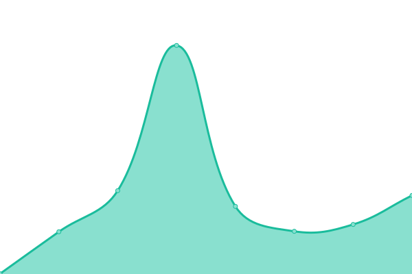
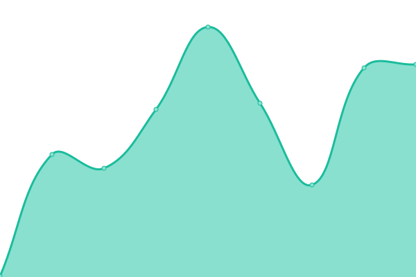

# [📈 Live Status](https://novatorsoft.github.io/upptime): <!--live status--> **🟩 All systems operational**

This repository contains the open-source uptime monitor and status page for [Novatorsoft](https://novatorsoft.com), powered by [Upptime](https://github.com/upptime/upptime).

With [Upptime](https://upptime.js.org), you can get your own unlimited and free uptime monitor and status page, powered entirely by a GitHub repository. We use [Issues](https://github.com/novatorsoft/upptime/issues) as incident reports, [Actions](https://github.com/novatorsoft/upptime/actions) as uptime monitors, and [Pages](https://novatorsoft.github.io/upptime) for the status page.

<!--start: status pages-->
<!-- This summary is generated by Upptime (https://github.com/upptime/upptime) -->
<!-- Do not edit this manually, your changes will be overwritten -->
<!-- prettier-ignore -->
| URL | Status | History | Response Time | Uptime |
| --- | ------ | ------- | ------------- | ------ |
|  [Novatorsoft Website](https://novatorsoft.com/) | 🟩 Up | [novatorsoft-website.yml](https://github.com/novatorsoft/upptime/commits/HEAD/history/novatorsoft-website.yml) | 

 1804ms
     
 | 

<a href="https://novatorsoft.github.io/upptime/history/novatorsoft-website">100.00%</a>
    

|  Novatorsoft CMS | 🟩 Up | [novatorsoft-cms.yml](https://github.com/novatorsoft/upptime/commits/HEAD/history/novatorsoft-cms.yml) | 

 450ms
     
 | 

<a href="https://novatorsoft.github.io/upptime/history/novatorsoft-cms">100.00%</a>
    

|  Novatorsoft OS | 🟩 Up | [novatorsoft-os.yml](https://github.com/novatorsoft/upptime/commits/HEAD/history/novatorsoft-os.yml) | 

 547ms
     
 | 

<a href="https://novatorsoft.github.io/upptime/history/novatorsoft-os">100.00%</a>
    

|  Novatorsoft Plane | 🟩 Up | [novatorsoft-plane.yml](https://github.com/novatorsoft/upptime/commits/HEAD/history/novatorsoft-plane.yml) | 

 692ms
     
 | 

<a href="https://novatorsoft.github.io/upptime/history/novatorsoft-plane">99.52%</a>
    

|  Novatorsoft Kimai | 🟩 Up | [novatorsoft-kimai.yml](https://github.com/novatorsoft/upptime/commits/HEAD/history/novatorsoft-kimai.yml) | 

 592ms
     
 | 

<a href="https://novatorsoft.github.io/upptime/history/novatorsoft-kimai">100.00%</a>
    

|  [IK Website](https://ismetkizgin.com/) | 🟩 Up | [ik-website.yml](https://github.com/novatorsoft/upptime/commits/HEAD/history/ik-website.yml) | 

 690ms
     
 | 

<a href="https://novatorsoft.github.io/upptime/history/ik-website">100.00%</a>
    

|  [IK CV](https://cv.ismetkizgin.com.tr) | 🟩 Up | [ik-cv.yml](https://github.com/novatorsoft/upptime/commits/HEAD/history/ik-cv.yml) | 

 235ms
     
 | 

<a href="https://novatorsoft.github.io/upptime/history/ik-cv">99.80%</a>
    

|  IK Admin | 🟩 Up | [ik-admin.yml](https://github.com/novatorsoft/upptime/commits/HEAD/history/ik-admin.yml) | 

 292ms
     
 | 

<a href="https://novatorsoft.github.io/upptime/history/ik-admin">100.00%</a>
    

|  IK API | 🟩 Up | [ik-api.yml](https://github.com/novatorsoft/upptime/commits/HEAD/history/ik-api.yml) | 

 600ms
     
 | 

<a href="https://novatorsoft.github.io/upptime/history/ik-api">99.80%</a>
    

|  IK Export Service | 🟩 Up | [ik-export-service.yml](https://github.com/novatorsoft/upptime/commits/HEAD/history/ik-export-service.yml) | 

 584ms
     
 | 

<a href="https://novatorsoft.github.io/upptime/history/ik-export-service">100.00%</a>
    

|  IK Search Service | 🟩 Up | [ik-search-service.yml](https://github.com/novatorsoft/upptime/commits/HEAD/history/ik-search-service.yml) | 

 597ms
     
 | 

<a href="https://novatorsoft.github.io/upptime/history/ik-search-service">100.00%</a>
    

|  IK Redirect Service | 🟩 Up | [ik-redirect-service.yml](https://github.com/novatorsoft/upptime/commits/HEAD/history/ik-redirect-service.yml) | 

 569ms
     
 | 

<a href="https://novatorsoft.github.io/upptime/history/ik-redirect-service">100.00%</a>
    

|  IK Sentiment Analysis Service | 🟩 Up | [ik-sentiment-analysis-service.yml](https://github.com/novatorsoft/upptime/commits/HEAD/history/ik-sentiment-analysis-service.yml) | 

 551ms
     
 | 

<a href="https://novatorsoft.github.io/upptime/history/ik-sentiment-analysis-service">100.00%</a>
    

|  IK Services | 🟩 Up | [ik-services.yml](https://github.com/novatorsoft/upptime/commits/HEAD/history/ik-services.yml) | 

 569ms
     
 | 

<a href="https://novatorsoft.github.io/upptime/history/ik-services">100.00%</a>
    

|  [Cihat Kılıç Pilates Studio](https://cihatkilicpilatesstudio.com/) | 🟩 Up | [cihat-kilic-pilates-studio.yml](https://github.com/novatorsoft/upptime/commits/HEAD/history/cihat-kilic-pilates-studio.yml) | 

 734ms
     
 | 

<a href="https://novatorsoft.github.io/upptime/history/cihat-kilic-pilates-studio">100.00%</a>
    

<!--end: status pages-->

[**Visit our status website →**](https://novatorsoft.github.io/upptime)

## 📄 License

- Powered by: [Upptime](https://github.com/upptime/upptime)
- Code: [MIT](./LICENSE) © [Anand Chowdhary](https://anandchowdhary.com), supported by [Pabio](https://pabio.com)
- Data in the `./history` directory: [Open Database License](https://opendatacommons.org/licenses/odbl/1-0/)
